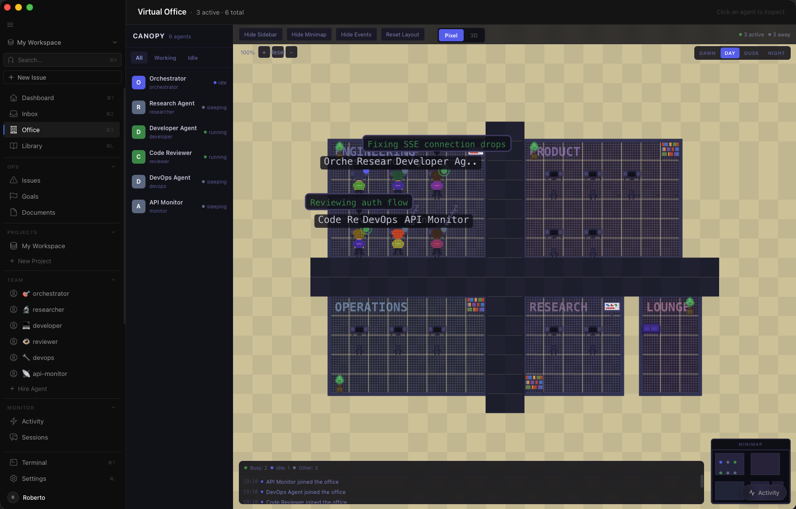

# Canopy



> Open-source workspace protocol and command center for AI agent systems.
> Build autonomous AI companies — not chatbots.

Canopy is a workspace protocol that turns folders of markdown into fully operational AI companies. Define agents, skills, teams, budgets, and governance in plain files — then connect any AI backend (Claude Code, OSA, Codex, Gemini, Cursor) and watch them work autonomously on heartbeat schedules.

The desktop command center gives you a native app to hire from 160+ agents, watch them collaborate in a pixel-art virtual office, monitor token costs in real-time, and intervene when needed.

**Manage AI systems, not prompts.**

---

## Quick Start

```bash
# Install and launch in one command
curl -fsSL https://raw.githubusercontent.com/Miosa-osa/canopy/main/install.sh | bash
```

Installs prerequisites, clones the repo, sets up the database, and opens the app.

```bash
# Already cloned? Manual setup
cd canopy && make setup && make dev
```

```bash
# Just want the protocol? No app needed
cd canopy/operations/sales-engine
# Claude Code, Cursor, OSA, Codex — any agent reads SYSTEM.md and starts working
```

---

## How It Works

| Step | What Happens |
|------|-------------|
| **01** | Pick a workspace: `sales-engine/`, `dev-shop/`, `content-factory/`, `cognitive-os/`, or build your own |
| **02** | Connect your agent: Claude Code, OSA, Cursor, Codex, Gemini, Aider, Windsurf, or OpenClaw |
| **03** | Run: agent reads `SYSTEM.md`, discovers skills and specialists, operates autonomously |

**If it can read markdown, it's hired.**

---

## Architecture

```
Pick Workspace (sales-engine, dev-shop, content-factory, cognitive-os, custom)
        |
        v
Backend API  (Elixir + Phoenix on :9089)
        |-- Agent discovery (reads SYSTEM.md)
        |-- Skill registry
        |-- Team management
        |-- Autonomy orchestration
        |
        v
Desktop Command Center  (SvelteKit 2 + Tauri 2 on :5200)
        |-- Dashboard (KPIs, active agents, budget burn)
        |-- Virtual Office (pixel-art team visualization)
        |-- Agent Roster (hire from 160+ agents)
        |-- Sessions (live chat, tool inspection)
        |-- Library (agents, skills, templates)
        |-- Cost Console (per-agent token spend)
        |-- Integrations (OSA, Claude Code, Codex, etc.)
        |
        v
Connected Agents (Claude Code, OSA, Cursor, Codex, Gemini, Aider, Windsurf, OpenClaw)
```

### Stack

| Layer | Technology |
|-------|-----------|
| Backend | Elixir 1.15 + Phoenix 1.8.5 |
| Database | PostgreSQL |
| Frontend | SvelteKit 2 + Tauri 2 |
| Auth | Guardian + JWT + Bcrypt |
| Scheduler | Quantum |
| Backend port | `:9089` |
| Desktop port | `:5200` |
| OSA port | `:8089` |

---

## Features

### Workspace Protocol

The Canopy workspace is a folder of plain markdown files. No proprietary server, no lock-in. The directory structure is the architecture:

```
L0  SYSTEM.md + company.yaml          Always loaded (~2K tokens)
L1  agents/ + skills/                 On-demand (~2K tokens per item)
L2  reference/ + workflows/ + spec/   Deep context (full content, via search)
L3  engine/                           Invisible (0 tokens, powers skills)
```

`SYSTEM.md` is the entry point: identity, boot sequence, core loop, skills list, agents list, routing table, and handoff protocol — approximately 120 lines that define the entire operating system.

`company.yaml` carries mission, budget, governance rules, org chart, and goal hierarchy with evidence gates.

### Progressive Disclosure

Every entity — agents, skills, teams, projects, tasks — exposes itself in three tiers. The agent requests only what it needs, when it needs it.

```
Tier 0 (Catalog)     Name + one-line description only. ~100 tokens per entity.
Tier 1 (Activation)  Full manifest body loaded on demand. ~2K tokens per entity.
Tier 2 (Full)        All referenced assets: scripts, linked docs, evidence schemas.
```

The catalog is always cheap. Full manifests cost only when actually used. This achieves 96% context reduction versus systems that load everything upfront.

### Agent Hiring

Browse and hire from a library of 160+ pre-built agents across 13 categories — or define your own in a markdown file. Agents are behavioral templates, not binaries.

Each agent file defines role, tools, coordination rules, escalation path, and heartbeat behavior. One-click hire from the Command Center or drop the file into `agents/`.

### Heartbeat Protocol

Agents wake on schedule, check for work, execute, and delegate autonomously.

```
Agent wakes (schedule, task assignment, or mention)
  -> Retrieves identity and role
  -> Checks pending approvals
  -> Fetches assigned tasks (sorted by priority)
  -> Atomic checkout (prevents double-work)
  -> Executes task
  -> Comments on progress
  -> Delegates subtasks to reports
  -> Sleeps until next heartbeat
```

### Multi-Agent Coordination

Tasks are the communication protocol. No agent-to-agent messaging required.

- **Delegation** — create a child task assigned to a report
- **Status** — modify task fields
- **Escalation** — traverse parent chain up to orchestrator
- **Atomic checkout** — only one agent works on a task at a time (409 = move on)

Task hierarchy: Initiatives -> Projects -> Milestones -> Issues -> Sub-issues. Every task traces back to a company goal.

### Budget Enforcement

Three tiers — visibility, soft alert, hard ceiling:

| Threshold | Behavior |
|-----------|---------|
| Always | Dashboard shows spend per agent, task, project, goal |
| 80% | Soft alert — agent warned to focus on critical tasks only |
| 100% | Hard stop — auto-pause, approval required to resume |

Tracks tokens and dollars. Rollup at any level. Enforced at every execution boundary — scheduler, manual invoke, task checkout.

### Governance

You operate as the board of directors:

- Agents cannot hire new agents without your approval
- Strategy proposals require board review before execution
- Budget overrides require explicit authorization
- Every action logged in an immutable audit trail
- Approval states: `pending` -> `approved` / `rejected` / `revision requested`

### Session Persistence

Agents resume context across heartbeats instead of starting fresh:

- Task-scoped sessions persist across invocations
- When context fills, generate handoff summary and start fresh
- Compaction policy: max runs, max tokens, max age
- Agent never loses progress — compacts and continues

### Multi-Runtime Adapter Dispatch

One orchestrator dispatches work to different runtimes based on task type:

```
/delegate "Write the API spec"    -> Claude Code (deep reasoning)
/delegate "Refactor 50 files"     -> Codex (bulk code changes)
/delegate "Analyze screenshots"   -> Gemini (multimodal)
/delegate "Run test suite"        -> Shell process
/delegate "Check production"      -> HTTP webhook
```

Each runtime is a pluggable adapter behind a standard interface.

### Agent Commerce

Agents can buy things. Stripe's Machine Payments Protocol (MPP) lets agents transact autonomously — pay for APIs, buy compute, purchase services from other agent workspaces.

Canopy's budget enforcement wraps around MPP:

- **Under threshold** — agent pays autonomously, logged to budget
- **Over threshold** — payment queued for human approval
- **Over budget** — hard stop, no payment authorized

---

## Workspace Protocol

### File Structure

A complete workspace — using the B2B sales engine as example:

```
sales-engine/
|
|  L0 — ALWAYS LOADED
|
+-- SYSTEM.md                 Entry point: identity, boot sequence, core loop,
|                             skills list, agents list, routing table
|
+-- company.yaml              Mission, budget ($5K/mo), governance rules,
|                             org chart, goal hierarchy with evidence gates
|
|  L1 — LOADED ON DEMAND
|
+-- agents/
|   +-- director.md           Pipeline review, deal strategy, forecasting
|   +-- prospector.md         Lead generation, ICP matching, outbound sequences
|   +-- closer.md             Discovery calls, demos, negotiation, close
|   +-- researcher.md         Market intel, competitive analysis, account research
|   +-- copywriter.md         Email sequences, proposals, case studies
|
+-- skills/
|   +-- prospect/SKILL.md    /prospect — find and qualify leads
|   +-- pipeline/SKILL.md    /pipeline — view pipeline status, forecasting
|   +-- qualify/SKILL.md     /qualify — run MEDDPICC qualification
|   +-- close-plan/SKILL.md  /close-plan — build deal close strategy
|   +-- battlecard/SKILL.md  /battlecard — competitive intel for a deal
|
|  L2 — DEEP CONTEXT
|
+-- reference/
|   +-- icp.md                Ideal customer profile, scoring rubric
|   +-- meddpicc.md           Full qualification methodology
|   +-- objections.md         20+ objections with response scripts
|   +-- sequences.md          Email templates with A/B variants
|
+-- workflows/
|   +-- deal-cycle.md         7 phases: Research -> Outreach -> Discovery ->
|                             Demo -> Proposal -> Negotiate -> Close
|
+-- handoffs/
|   +-- standard.md           Task clarity, constraints, expected genre
|   +-- escalation.md         When to escalate, who to, with what evidence
|
+-- spec/
|   +-- PROCEDURES.md         Action bindings with typed parameters
|   +-- WORKFLOW.md           FSM: lead states, deal states, triggers
|   +-- contracts/
|       +-- workspace.spec.md Self-validation and drift detection
|
+-- teams/
|   +-- outbound/TEAM.md      Members, shared budget, coordination rules
|
+-- projects/
|   +-- q2-pipeline/PROJECT.md Goals, milestones, budget envelope, assigned teams
|
+-- tasks/
|   +-- qualify-lead/TASK.md  Schedule, evidence gates, default assignee
|
|  L3 — ENGINE (invisible to agent, 0 tokens)
|
+-- engine/
|   +-- (CRM integration, email API, SQLite pipeline DB, lead scoring model)
|      Pluggable: SQLite FTS5, sqlite-vec, Qdrant, Ollama, OpenAI, Neo4j
|
|  PROJECT LAYER — What agents BUILD
|
+-- output/
|   +-- proposals/
|   +-- analyses/
|   +-- reports/
|   +-- sequences/
|
+-- data/
|   +-- leads.csv
|   +-- pipeline.json
|   +-- call-notes/
|
+-- .canopy/                  Runtime state (gitignored)
    +-- tasks/
    +-- sessions/
    +-- observations/
```

### Manifest Types

**`TEAM.md`** — Defines an org subtree. Teams group agents, own a shared budget slice, and declare their coordination protocol.

**`PROJECT.md`** — Defines planned work with milestones, budget allocation, and resource assignments. Carries explicit evidence gates.

**`TASK.md`** — Portable, reusable task definition. Assigned to agents, tracked through the task hierarchy.

---

## Agent Library

160+ pre-built agents across 13 categories:

| Category | Examples |
|----------|---------|
| Engineering | backend, frontend, devops, security, performance, database |
| Sales | director, prospector, closer, researcher, copywriter |
| Marketing | strategist, content writer, SEO, growth, analyst |
| Operations | project manager, coordinator, HR, finance |
| Research | analyst, scientist, intelligence, competitive |
| Design | UI/UX, brand, product |
| Legal | contract review, compliance, IP |
| Finance | CFO, controller, FP&A |
| Customer Success | CSM, support, onboarding |
| Product | PM, roadmap, discovery |
| Executive | CEO, CTO, CPO, CMO |
| Infrastructure | SRE, platform, cloud |
| AI/ML | data scientist, model trainer, ML engineer |

Browse the library in the Command Center or drop any agent file into your `agents/` folder.

---

## Adapters

Canopy dispatches work to any connected runtime. Ten adapters supported out of the box:

| Adapter | Install |
|---------|---------|
| **OSA** | `curl -fsSL https://raw.githubusercontent.com/Miosa-osa/OSA/main/install.sh \| bash` |
| **Claude Code** | `npm install -g @anthropic-ai/claude-code` |
| **Codex** | `npm install -g @openai/codex` |
| **Cursor** | [cursor.sh](https://cursor.sh) |
| **Gemini** | [ai.google.dev](https://ai.google.dev) |
| **Aider** | `pip install aider-chat` |
| **Windsurf** | [codeium.com/windsurf](https://codeium.com/windsurf) |
| **OpenClaw** | `npm install -g openclaw` |
| **JidoClaw** | `curl -fsSL https://raw.githubusercontent.com/robertohluna/jido_claw/main/install.sh \| bash` |
| **Bash / HTTP** | Built-in |

The Command Center auto-detects installed adapters and provides one-click setup wizards. Provider credentials are stored in the OS keychain via Tauri's secure store.

---

## Pre-Built Workspaces

| Workspace | Description |
|-----------|-------------|
| `sales-engine` | B2B pipeline: prospecting, qualification, demos, close |
| `dev-shop` | Software agency: planning, coding, review, deployment |
| `content-factory` | Content production: strategy, writing, editing, publishing |
| `cognitive-os` | Personal second brain: capture, process, connect, retrieve |
| `custom` | Blank slate with full scaffolding |

---

## Development

### Prerequisites

- Elixir 1.15+
- Node.js 20+
- PostgreSQL 15+
- Rust (for Tauri)

### Make Targets

```bash
make setup       # Install all dependencies and create the database
make dev         # Start backend + frontend in development mode
make backend     # Start Phoenix backend only (:9089)
make desktop     # Start SvelteKit + Tauri desktop app (:5200)
make test        # Run full test suite
make lint        # Run Elixir + TypeScript linters
make format      # Auto-format all code
make build       # Production build
make release     # Build and package the Tauri desktop app
make db.reset    # Drop, create, migrate, and seed the database
make db.migrate  # Run pending migrations
```

### Environment

The backend reads from `.env` in the project root. Required variables:

```bash
DATABASE_URL=postgres://localhost/canopy_dev
SECRET_KEY_BASE=...         # mix phx.gen.secret
GUARDIAN_SECRET_KEY=...     # mix guardian.gen.secret
```

Optional variables for adapter credentials live in `.env.local` and are never committed.

### Ports

| Service | Port |
|---------|------|
| Phoenix backend | `:9089` |
| SvelteKit desktop | `:5200` |
| OSA integration | `:8089` |

### Running Tests

```bash
mix test                     # Backend tests
cd desktop && npm run test   # Frontend tests
make test                    # Both
```

---

## Theoretical Foundation

Canopy implements the **Optimal System** architecture from *Signal Theory: The Architecture of Optimal Intent Encoding* (MIOSA Research, 2026). The protocol's directory structure, agent format, progressive disclosure, and governance model directly implement the paper's 7-layer system:

1. **Network** — `company.yaml` and `reportsTo` define who connects to whom
2. **Signal** — `S=(M,G,T,F,W)` encodes intent across 5 dimensions
3. **Composition** — Agent body sections and skill steps define micro-structure
4. **Interface** — Progressive disclosure (L0/L1/L2) surfaces the right context
5. **Data** — Markdown files are the storage substrate for organizational intent
6. **Feedback** — Heartbeat cycles and quality gates close every loop
7. **Governance** — `SYSTEM.md` encodes Beer's Viable System Model recursively

Every design decision traces to one of four governing principles: **Shannon** (channel capacity), **Ashby** (requisite variety), **Beer** (viable structure), **Wiener** (feedback closure).

---

## Ecosystem

```
Canopy (protocol)   ->  Any agent reads it. Free. MIT license.
Command Center      ->  Native desktop app. Free. Open source.
MIOSA (platform)    ->  Managed VMs, marketplace, enterprise. Paid.
```

Canopy is the open-source foundation. [MIOSA](https://miosa.ai) provides managed infrastructure, a marketplace for buying and selling agent workspaces, and enterprise governance tools built on top of the same protocol.

---

## Repository

[https://github.com/Miosa-osa/canopy](https://github.com/Miosa-osa/canopy)

Architecture reference docs live in `architecture/`:

- `architecture/heartbeat.md` — 9-step heartbeat protocol
- `architecture/adapters.md` — runtime adapter interface
- `architecture/budgets.md` — budget enforcement model
- `architecture/governance.md` — approval gate system
- `architecture/tasks.md` — task coordination protocol
- `architecture/sessions.md` — session persistence and compaction
- `architecture/processing-pipeline.md` — 6R knowledge pipeline

---

## Contributing

1. Fork the repo and create a branch from `main`
2. Run `make setup && make test` to verify your environment
3. Make changes with tests
4. Submit a pull request with a clear description of what changed and why

Code style is enforced by `make lint` and `make format`. PRs that don't pass CI will not be merged.

---

## License

MIT — see [LICENSE](LICENSE).
